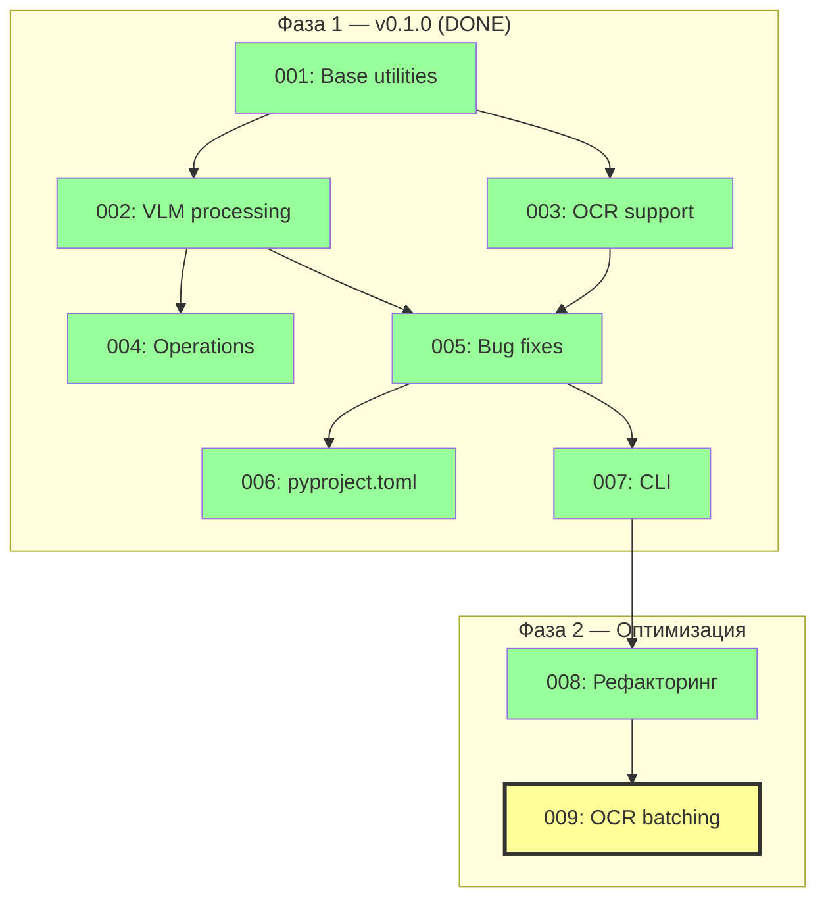

# Implementation Plan: vlm-ocr-doc-reader

**Версия:** 3.0
**Дата:** 2026-02-20
**Автор:** Tech Lead
**Статус:** Фаза 1 завершена, Фаза 2 — эскалация к Architect

---

## Цель

Универсальный переиспользуемый Python-пакет для работы с документами через Vision Language Models (VLM) и OCR.

**Ключевые требования:**
- Контракт с проектом `07_agentic-doc-processing` через `FullDescriptionOperation`
- Гибридный подход: VLM для понимания контекста + OCR для точности
- Поддержка PDF файлов и массивов PNG как входных данных
- State management для разработки и тестирования
- Operations-based подход (только через `.execute()`)

---

## Фаза 1: v0.1.0 — Базовая реализация (ЗАВЕРШЕНА)

### Структура задач

| Задача | Модули | Статус |
|--------|--------|--------|
| 1. Base utilities | PDFRenderer, OCR нормализация, StateManager | Выполнена |
| 2. VLM processing | GeminiVLMClient, VLMAgent, DocumentProcessor | Выполнена |
| 3. OCR support | QwenOCRClient, OCRTool | Выполнена |
| 4. High-level operations | FullDescriptionOperation | Выполнена |
| 5. Критические баги | JSON mode, VLMAgent, OCR Tool | Выполнена |
| 6. pyproject.toml | Пакетирование, entry points | Выполнена |
| 7. CLI интерфейс | cli.py, argparse, logging | Выполнена |

### Архитектура (фактическая)

```
CLI (cli.py)
 └→ FullDescriptionOperation
     └→ DocumentProcessor
         ├── StateManager (Memory/Disk)
         ├── PDFRenderer ([G{N}] markers, DPI 150)
         └── VLMAgent (max_iterations=100, max_tool_workers=5)
             ├── GeminiVLMClient (gemini-2.5-flash, contents=messages)
             └── ask_ocr tool → OCRTool(state_manager) → QwenOCRClient (qwen-vl-plus)
```

### Ключевые отличия от первоначального плана

**1. VLM Agent — conversation history (не было в плане v1/v2):**
- VLM Client принимает `contents` — полная история диалога Gemini
- VLM Agent передает `contents=self.messages` вместо single prompt
- Позволяет multi-turn dialogue и three-pass OCR стратегию

**2. OCRTool — самостоятельное получение изображений (рефакторинг 2026-02-09):**
- OCRTool принимает `state_manager` в конструкторе
- При вызове `execute(page_num, prompt)` сам загружает image из storage
- VLM Agent не управляет изображениями — только передает page_num

**3. Three-pass OCR стратегия (не было в плане v1/v2):**
- Проход 1: VLM читает весь текст со страниц самостоятельно
- Проход 2: VLM строит реестр OCR-сущностей (URLs, IDs, имена, телефоны)
- Проход 3: VLM вызывает ask_ocr для каждой сущности, подставляет результаты

**4. Параллельное выполнение tool calls (не было в плане v1/v2):**
- ThreadPoolExecutor(max_workers=5) в VLMAgent._execute_tool_calls()
- pool.map() сохраняет порядок результатов
- Gemini батчит вызовы недетерминированно (1/16/29/30 за итерацию)
- С параллелизацией: ~4x ускорение OCR

**5. Маркеры страниц [G{N}]:**
- PDFRenderer штампует `[G1]`, `[G2]` в верхнем левом углу
- VLM видит маркер → знает какой page_num передать в ask_ocr

**6. max_iterations увеличен до 100 (было 10):**
- При 66 OCR-вызовах и Gemini batching 1-per-iter нужен запас

### Интерфейсы (фактические)

#### ProcessorConfig
```python
@dataclass
class ProcessorConfig:
    state_dir: Optional[Path] = None
    auto_save: bool = True
    render_dpi: int = 150
    log_level: str = "INFO"
    max_tool_workers: int = 5       # Параллельных OCR workers
    max_iterations: int = 100       # Итераций tool calling loop
```

#### VLMAgent.invoke()
```python
def invoke(self, prompt: str, images: List[bytes]) -> Dict[str, Any]:
    # Добавляет prompt+images в self.messages
    # Вызывает VLM с contents=self.messages (полная история)
    # Tool calling loop: execute → collect results → repeat
    # ThreadPoolExecutor для параллельных tool calls
```

#### OCRTool.execute()
```python
def execute(self, page_num: int, prompt: str) -> Dict[str, Any]:
    # Сам загружает image из StateManager по page_num
    # Вызывает ocr_client.extract(image, prompt, page_num)
    # Возвращает {"status": "ok", "value": "...", "context": "...", "explanation": "..."}
```

### Результаты тестирования

Тестовый документ: `03_data/test_document.pdf` (8 страниц, ASX free float analysis)

| Запуск | Время | OCR calls | Parallel | Headers | Полный текст |
|--------|-------|-----------|----------|---------|-------------|
| run_174559 | 12 мин | 66 | Нет | 48 | Да |
| run_191547 | 2 мин | 0 | — | 56 | Нет (text=None) |
| run_192010 | 7 мин | 10 | Да (5w) | 49 | Нет (max_iter=10) |
| run_193215 | 6 мин | 65 | Да (5w) | 58 | Да |

**Вывод:** Parallel + max_iterations=100 = лучший результат (6 мин, 58 headers).

---

## Фаза 2: Оптимизация OCR (В ПЛАНИРОВАНИИ)

### Задача 008 — рефакторинг (ЗАВЕРШЕНА 2026-02-09)

Полный список изменений см. в `backlog.md` задача 008.

### Задача 009 — Page-based OCR batching (ЭСКАЛАЦИЯ К ARCHITECT)

**Проблема:** 66 отдельных ask_ocr вызовов → 66 отдельных Qwen API requests.
Даже с 5 параллельными воркерами, OCR занимает 3-5 минут.

**Целевая оптимизация:** Группировать запросы по page_num и отправлять один объединённый запрос на страницу.

**Требует архитектурного решения:** Формат объединённого промпта, парсинг ответа, обработка ошибок, режим сравнения V1/V2.

**Подробности:** `00_docs/architecture/_questions_architect.md`

---

## Зависимости между фазами



---

## История изменений

| Дата | Версия | Изменения | Автор |
|------|--------|-----------|-------|
| 2026-02-20 | 3.0 | Актуализация: фиксация фактической архитектуры (conversation history, parallel OCR, three-pass), добавлена Фаза 2, результаты тестирования | Tech Lead |
| 2026-01-27 | 2.0 | Переписан с учетом отзывов (4 задачи, invoke(), без Page Batching) | Tech Lead |
| 2026-01-27 | 1.0 | Первый черновик | Tech Lead |
