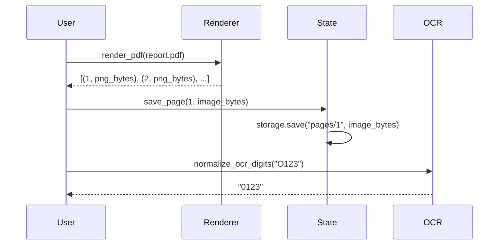
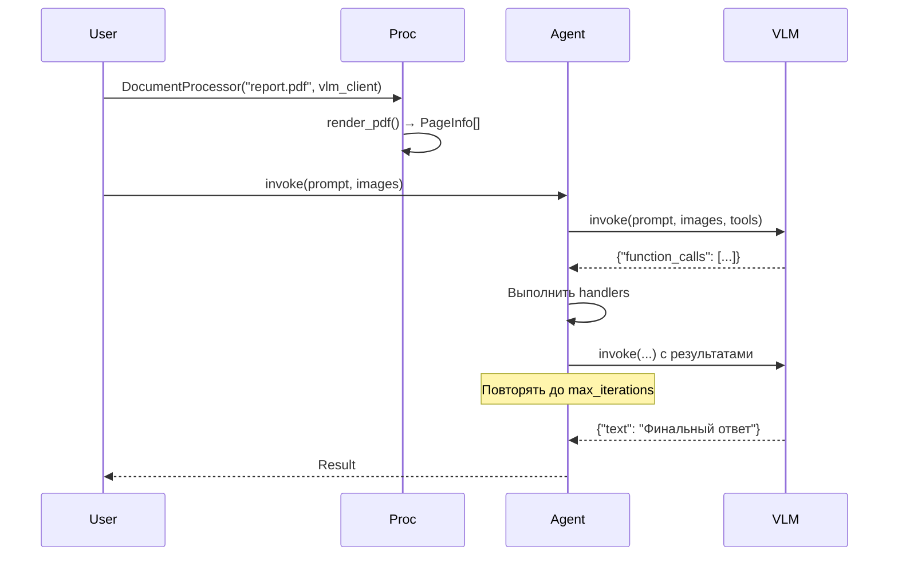
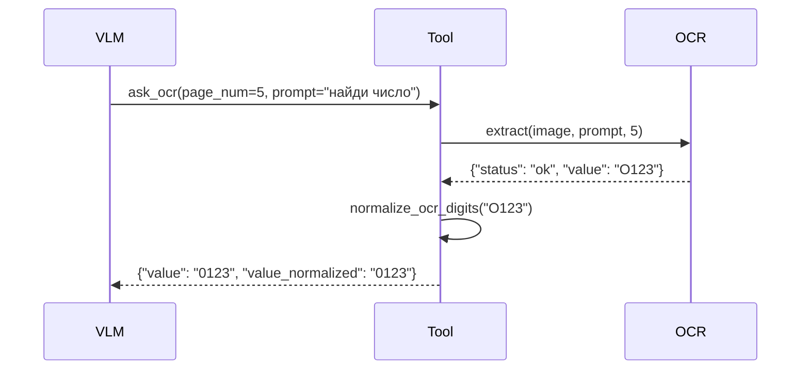
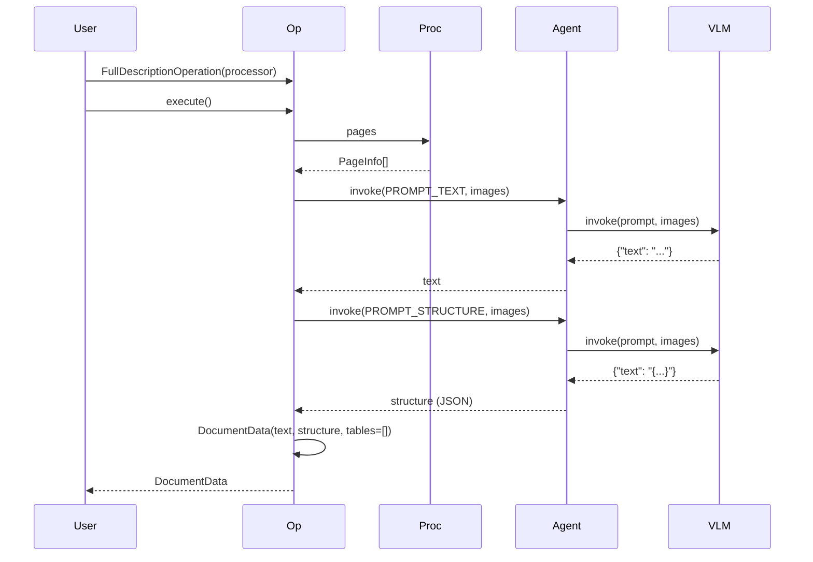
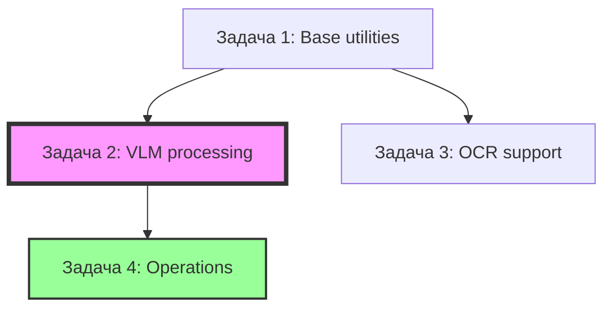

# Implementation Plan: vlm-ocr-doc-reader

**Версия:** 2.0
**Дата:** 2025-01-27
**Автор:** Tech Lead
**Статус:** План реализации

---

## Цель

Создать универсальный переиспользуемый Python-пакет для работы с документами через Vision Language Models (VLM) и OCR.

**Ключевые требования:**
- Контракт с проектом `07_agentic-doc-processing` через `FullDescriptionOperation`
- Переиспользование паттернов из `05_a_reports_ETL_02` (скопированы в `02_src/_reference/`)
- Поддержка PDF файлов и массивов PNG как входных данных
- State management для разработки и тестирования
- Operations-based подход (нет методов на процессоре, только через `.execute()`)

**⚠️ ВАЖНО:** Все разработчики обязаны работать в виртуальном окружении. Установку библиотек выполнять через pip/poetry в venv.

---

## Структура задач

**Задача 1: Base utilities**
- PDF Renderer
- OCR нормализация
- State Manager

**Задача 2: VLM processing** (критический путь)
- VLM Client
- VLM Agent
- DocumentProcessor

**Задача 3: OCR support** (параллельно с Задачей 2)
- OCR Client
- OCR Tool

**Задача 4: High-level operations**
- FullDescriptionOperation

**Параллельность:**
- Задачи 1 и 2 можно запускать параллельно
- Задача 3 можно запускать параллельно с Задачей 2 (минимум зависимостей)
- Задача 4 после завершения Задачи 2

---

## Задача 1: Base utilities

**Цель:** Реализовать базовые утилиты - рендеринг PDF, нормализацию OCR и управление состоянием. Независимые компоненты, которые используются другими задачами.

**Модули:**
1. PDF Renderer (рендеринг PDF→PNG)
2. OCR нормализация (утилита для исправления OCR ошибок)
3. State Manager (Memory + Disk backends)

### Интерфейсы

#### PDF Renderer

```python
from typing import List, Tuple, Optional
from pathlib import Path
from dataclasses import dataclass

@dataclass
class RenderConfig:
    """Конфигурация рендеринга."""
    dpi: int = 150
    quality: int = 85
    format: str = "PNG"

class PDFRenderer:
    """Рендеринг PDF страниц в изображения."""

    def __init__(self, config: RenderConfig):
        self.config = config

    def render_pdf(
        self,
        pdf_path: Path,
        page_indices: Optional[List[int]] = None
    ) -> List[Tuple[int, bytes]]:
        """Рендерит PDF страницы в PNG bytes.

        Args:
            pdf_path: Путь к PDF файлу
            page_indices: Список индексов (0-based), None = все страницы

        Returns:
            List of (page_num, image_bytes)
            page_num - 1-based номер страницы
        """
        pass

    def render_page(
        self,
        pdf_path: Path,
        page_num: int,
        dpi: Optional[int] = None
    ) -> bytes:
        """Рендерит одну страницу с кастомным DPI."""
        pass
```

**Reference:** `02_src/_reference/pdf_utils.py` из проекта 05_a_reports_ETL_02

**Ключевые параметры:**
- DPI: 110-150 (баланс качества/размера)
- Quality: 80-85 (для JPEG)
- Использовать pymupdf (fitz)

---

#### OCR нормализация

```python
from typing import Optional

def normalize_ocr_digits(raw: str, expected_length: Optional[int] = None) -> Optional[str]:
    """OCR нормализация для числовых полей.

    Заменяет: O→0, l→1, I→1, S→5, B→8

    Args:
        raw: Сырой текст из OCR
        expected_length: Ожидаемая длина (optional)

    Returns:
        Нормализованная строка или None
    """
    cleaned = (
        str(raw)
        .replace(" ", "")
        .replace("\xa0", "")
        .replace("-", "")
        .replace("O", "0")
        .replace("o", "0")
        .replace("l", "1")
        .replace("I", "1")
        .replace("S", "5")
        .replace("B", "8")
    )

    digits = "".join(ch for ch in cleaned if ch.isdigit())

    if expected_length and len(digits) != expected_length:
        return None

    return digits or None
```

**Reference:** `02_src/_reference/tools.py` из проекта 05_a_reports_ETL_02

---

#### State Manager

```python
from typing import Protocol, Dict, Any, Optional
from pathlib import Path
from dataclasses import dataclass

class StorageBackend(Protocol):
    """Протокол хранилища состояния."""

    def save(self, key: str, value: Any) -> None:
        """Сохранить значение по ключу."""
        ...

    def load(self, key: str, default: Any = None) -> Any:
        """Загрузить значение по ключу."""
        ...

    def exists(self, key: str) -> bool:
        """Проверить существование ключа."""
        ...

class MemoryStorage:
    """In-memory хранилище."""
    def __init__(self):
        self._data: Dict[str, Any] = {}

class DiskStorage:
    """Файловое хранилище (JSON/YAML)."""
    def __init__(self, state_dir: Path):
        self.state_dir = state_dir
        self.cache_dir = state_dir / "cache"
        self.results_dir = state_dir / "results"
        self.logs_dir = state_dir / "logs"

@dataclass
class DocumentState:
    """Состояние документа."""
    pages: Dict[int, bytes]  # page_num → image_bytes
    vlm_responses: Dict[str, Any]  # operation → response
    operation_results: Dict[str, Any]  # operation → result

class StateManager:
    """Менеджер состояния документа."""

    def __init__(self, storage: StorageBackend):
        self.storage = storage
        self.state = DocumentState(pages={}, vlm_responses={}, operation_results={})

    def save_page(self, page_num: int, image: bytes) -> None:
        """Сохранить рендеренную страницу."""

    def load_page(self, page_num: int) -> Optional[bytes]:
        """Загрузить рендеренную страницу."""

    def save_vlm_response(self, operation: str, response: Dict) -> None:
        """Сохранить VLM ответ."""

    def save_operation_result(self, operation: str, result: Any) -> None:
        """Сохранить результат operation (YAML формат)."""

    def save_state(self) -> None:
        """Явное сохранение всего состояния."""

    def load_state(self) -> None:
        """Загрузить состояние из storage."""
```

**Структура state_dir при DiskStorage:**

```
state_dir/
├── cache/
│   ├── pages/              # Рендеренные страницы (PNG)
│   │   ├── page_001.png
│   │   ├── page_002.png
│   │   └── ...
│   └── vlm_responses/      # VLM ответы (JSON)
│       ├── response_full_desc.json
│       └── response_cluster.json
│
├── results/                # Результаты operations (YAML)
│   ├── full_description.yaml
│   ├── clustering.yaml
│   ├── triage.yaml
│   └── extraction.yaml
│
├── logs/                   # Логи
│   └── vlm_ocr.log
│
└── state.json              # Metadata (auto_save, DPI, etc.)
```

---

### Критерии готовности

- [ ] `PDFRenderer.render_pdf()` для всех страниц
- [ ] `PDFRenderer.render_page()` с кастомным DPI
- [ ] `normalize_ocr_digits()` с заменами O→0, l→1, S→5, B→8
- [ ] `StateManager` с Memory и Disk backends
- [ ] Unit тесты для рендеринга (размер изображений, DPI)
- [ ] Unit тесты для State Manager (save/load)

---

### Визуализация



---

## Задача 2: VLM processing (критический путь)

**Цель:** Реализовать ядро системы - VLM клиент, VLM агент и DocumentProcessor. Это критический путь для всех операций.

**Модули:**
1. VLM Client (Gemini REST API с retry и throttling)
2. VLM Agent (tool calling loop)
3. DocumentProcessor (главный класс)

### Интерфейсы

#### VLM Client

```python
from typing import List, Dict, Any, Optional
from dataclasses import dataclass
import time

@dataclass
class VLMConfig:
    """Конфигурация VLM клиента."""
    api_key: str
    model: str = "gemini-2.5-flash"
    timeout_sec: int = 60
    max_retries: int = 3
    backoff_base: float = 1.5
    min_interval_s: float = 0.6  # Throttling

class BaseVLMClient:
    """Базовый интерфейс VLM клиента."""

    def invoke(
        self,
        prompt: str,
        images: List[bytes],
        tools: Optional[List[Dict]] = None
    ) -> Dict[str, Any]:
        """Универсальный метод вызова VLM.

        Args:
            prompt: Текстовый промпт
            images: Список изображений (PNG bytes)
            tools: Если переданы - использовать function calling

        Returns:
            С tools: {"function_calls": [...], "text": Optional[str]}
            Без tools: {"text": str, "usage": {...}}
        """
        raise NotImplementedError

class GeminiVLMClient(BaseVLMClient):
    """Gemini REST API клиент с retry и throttling."""

    def __init__(self, config: VLMConfig):
        self.config = config
        self._last_call_ts: Optional[float] = None
        self._calls_made = 0

    def _throttle(self) -> None:
        """Гарантирует min_interval_s между вызовами."""
        if self._last_call_ts is None:
            return
        elapsed = time.monotonic() - self._last_call_ts
        if elapsed < self.config.min_interval_s:
            time.sleep(self.config.min_interval_s - elapsed)

    def _make_request_with_retry(
        self,
        url: str,
        headers: Dict,
        payload: Dict
    ) -> Dict:
        """Retry с exponential backoff.

        Retry на: 429 (rate limit), 500-599 (server errors)
        Формула: sleep_s = backoff_base ** (attempt - 1)
        """
        pass
```

**Reference:** `02_src/_reference/gemini_client.py` и `02_src/_reference/vlm_client.py`

**Ключевые параметры:**
- `min_interval_s: 0.6` - throttling между вызовами
- `max_retries: 3` - количество попыток
- `backoff_base: 1.5` - exponential backoff

---

#### VLM Agent

```python
from typing import List, Dict, Any, Callable, Optional

class VLMAgent:
    """VLM Agent - агентская сущность с tool calling loop.

    Отвечает за:
    - Управление промптами (system/user)
    - Tool calling loop (max 10 итераций)
    - Вызов tools
    """

    def __init__(
        self,
        vlm_client: BaseVLMClient,
        max_iterations: int = 10
    ):
        self.vlm_client = vlm_client
        self.max_iterations = max_iterations
        self.messages: List[Dict] = []
        self.tools: Dict[str, Callable] = {}  # tool_name → handler

    def register_tool(self, tool_def: Dict, handler: Callable) -> None:
        """Зарегистрировать tool.

        Args:
            tool_def: Определение tool для VLM
            handler: Функция-обработчик вызова tool
        """
        tool_name = tool_def["function_declarations"][0]["name"]
        self.tools[tool_name] = handler
        # Добавить tool_def в messages

    def set_system_prompt(self, prompt: str) -> None:
        """Установить system prompt."""
        self.messages = [{"role": "user", "parts": [{"text": prompt}]}]

    def invoke(self, prompt: str, images: List[bytes]) -> Dict[str, Any]:
        """Выполнить запрос с tool calling loop.

        Algorithm:
        1. Добавить prompt в messages
        2. Вызвать VLM с tools
        3. Если есть function_calls:
           - Выполнить каждую функцию через handlers
           - Добавить результаты в messages
           - Повторить с шага 2 (max 10 итераций)
        4. Если есть text - вернуть финальный ответ

        Returns:
            Финальный ответ после tool calling loop
        """
        pass
```

**Reference:** `02_src/_reference/hybrid_dialogue.py` (function calling pattern)

**Tool definition формат:**
```python
tool_def = {
    "function_declarations": [
        {
            "name": "ask_ocr",
            "description": "Извлечь данные с изображения",
            "parameters": {
                "type": "object",
                "properties": {
                    "page_num": {"type": "integer"},
                    "prompt": {"type": "string"}
                },
                "required": ["page_num", "prompt"]
            }
        }
    ]
}
```

---

#### DocumentProcessor

```python
from typing import Union, List, Optional
from pathlib import Path
from dataclasses import dataclass

@dataclass
class PageInfo:
    """Информация о странице."""
    page_num: int  # 1-based
    image: bytes  # Рендеренное изображение

@dataclass
class ProcessorConfig:
    """Конфигурация процессора."""
    state_dir: Optional[Path] = None
    auto_save: bool = True
    render_dpi: int = 150  # Дефолтный DPI для рендеринга
    log_level: str = "INFO"

class DocumentProcessor:
    """Главный класс для работы с документами.

    Поддерживаемые входные данные:
    - PDF файл (автоматический рендеринг)
    - Массив PNG (используются как есть)
    """

    def __init__(
        self,
        source: Union[Path, List[bytes]],
        vlm_client: BaseVLMClient,
        state_manager: Optional[StateManager] = None,
        auto_save: bool = True,
        config: Optional[ProcessorConfig] = None
    ):
        """Инициализация процессора.

        Args:
            source: PDF путь или список PNG bytes
            vlm_client: VLM клиент (обязателен)
            state_manager: State manager (optional, создается если не передан)
            auto_save: Автосохранение результатов operations
            config: Конфигурация процессора
        """
        # Если source - PDF, рендерим через PDFRenderer
        # Если source - список PNG, используем как есть
        pass

    @property
    def pages(self) -> List[PageInfo]:
        """Список всех страниц документа."""
        pass

    @property
    def num_pages(self) -> int:
        """Количество страниц."""
        pass

    def save_state(self) -> None:
        """Явное сохранение состояния (при auto_save=False)."""
        pass

    def load_state(self) -> None:
        """Загрузка состояния из state_dir."""
        pass
```

**Логика инициализации:**
```python
# Внутри __init__:
if isinstance(source, Path):
    # PDF - рендерим через PDFRenderer
    renderer = PDFRenderer(RenderConfig(dpi=config.render_dpi))
    rendered = renderer.render_pdf(source)
    self._pages = [PageInfo(page_num=i, image=img) for i, img in rendered]
elif isinstance(source, list):
    # Массив PNG - используем как есть
    self._pages = [PageInfo(page_num=i+1, image=img) for i, img in enumerate(source)]
```

---

### Критерии готовности

- [ ] `GeminiVLMClient.invoke()` с retry и throttling
- [ ] `VLMAgent.invoke()` с tool calling loop (max 10 итераций)
- [ ] `VLMAgent.register_tool()` для регистрации handlers
- [ ] `DocumentProcessor` с инициализацией из PDF/PNG
- [ ] `DocumentProcessor.pages` и `num_pages`
- [ ] Unit тесты для VLM Client (retry на 429/500)
- [ ] Unit тесты для throttling (min_interval_s)
- [ ] Unit тесты для tool calling loop (1, 2, 10 итераций)
- [ ] Unit тесты для DocumentProcessor (PDF vs PNG)

---

### Визуализация



---

## Задача 3: OCR support

**Цель:** Реализовать OCR клиент и OCR tool. Опционально для v0.1.0, можно запускать параллельно с Задачей 2.

**Модули:**
1. OCR Client (Qwen VL API)
2. OCR Tool (агентская обертка)

### Интерфейсы

#### OCR Client

```python
from typing import Dict, Any, Optional
from dataclasses import dataclass

@dataclass
class OCRConfig:
    """Конфигурация OCR клиента."""
    api_key: str
    model: str = "qwen-vl-plus"
    timeout_sec: int = 60
    max_retries: int = 3
    backoff_base: float = 1.5

class BaseOCRClient:
    """Базовый интерфейс OCR клиента."""

    def extract(
        self,
        image: bytes,
        prompt: str,
        page_num: int
    ) -> Dict[str, Any]:
        """Извлечь данные с изображения.

        Returns:
            {
                "status": "ok" | "no_data" | "error",
                "value": str,  # Извлеченное значение
                "context": str,
                "explanation": str
            }
        """
        raise NotImplementedError

class QwenOCRClient(BaseOCRClient):
    """Qwen VL OCR клиент (OpenAI-compatible)."""
    pass
```

**Reference:** `02_src/_reference/qwen_client.py`

**Формат ответа:**
```
ЗНАЧЕНИЕ: <значение>
КОНТЕКСТ: <фрагмент текста>
ПОЯСНЕНИЕ: <объяснение>
```

---

#### OCR Tool

```python
class OCRTool:
    """OCR Tool - агентская сущность для вызова OCR.

    Используется VLM Agent через tools.
    """

    def __init__(self, ocr_client: BaseOCRClient):
        self.ocr_client = ocr_client

    def to_tool_definition(self) -> Dict:
        """Определение tool для VLM."""
        return {
            "function_declarations": [
                {
                    "name": "ask_ocr",
                    "description": "Извлечь данные с изображения",
                    "parameters": {
                        "type": "object",
                        "properties": {
                            "page_num": {"type": "integer"},
                            "prompt": {"type": "string"}
                        },
                        "required": ["page_num", "prompt"]
                    }
                }
            ]
        }

    def execute(self, page_num: int, prompt: str, image: bytes) -> Dict:
        """Выполнить OCR запрос.

        Использует normalize_ocr_digits() для пост-обработки.
        """
        result = self.ocr_client.extract(image, prompt, page_num)

        # Пост-обработка для числовых полей
        if result["status"] == "ok":
            normalized = normalize_ocr_digits(result["value"])
            if normalized:
                result["value_normalized"] = normalized

        return result
```

---

### Критерии готовности

- [ ] `QwenOCRClient.extract()` с retry logic
- [ ] `OCRTool.to_tool_definition()` - tool definition для VLM
- [ ] `OCRTool.execute()` с нормализацией
- [ ] Unit тесты для OCR Client

---

### Визуализация



---

## Задача 4: High-level operations

**Цель:** Реализовать FullDescriptionOperation - контракт с проектом 07_agentic-doc-processing. Это приоритет P0 для v0.1.0.

**Модули:**
1. BaseOperation (абстрактный базовый класс)
2. FullDescriptionOperation (основная операция)
3. Схемы данных (DocumentData, HeaderInfo, TableInfo)

### Интерфейсы

#### BaseOperation

```python
from abc import ABC, abstractmethod

class BaseOperation(ABC):
    """Базовый класс для всех operations."""

    def __init__(self, processor: DocumentProcessor):
        """Инициализация operation с процессором."""
        self.processor = processor

    @abstractmethod
    def execute(self, **kwargs) -> Any:
        """Выполнить операцию."""
        pass
```

---

#### Схемы данных

```python
from dataclasses import dataclass, field
from typing import List, Dict, Any, Optional

@dataclass
class HeaderInfo:
    """Информация о заголовке."""
    level: int  # 1, 2, 3...
    title: str
    page: int

@dataclass
class TableInfo:
    """Информация о таблице."""
    id: str  # "table_1", "table_2", ...
    type: str  # "NUMERIC" или "TEXT_MATRIX"
    page: int
    location: Dict[str, Any]  # {"bbox": [x1, y1, x2, y2], "page": int}
    preview: str  # Краткое описание
    cell_flattened: Optional[List[str]] = None  # Для TEXT_MATRIX (future)

@dataclass
class DocumentData:
    """Результат полного анализа документа - контракт с проектом 07."""
    text: str  # Полный текст документа
    structure: Dict[str, Any]  # {"headers": [HeaderInfo, ...]}
    tables: List[Dict[str, Any]] = field(default_factory=list)  # Пока пустой
```

---

#### FullDescriptionOperation

```python
from typing import Optional, List

class FullDescriptionOperation(BaseOperation):
    """Полное описание документа - контракт с проектом 07.

    Приоритет P0 для v0.1.0
    """

    def __init__(
        self,
        processor: DocumentProcessor,
        render_dpi: Optional[int] = None
    ):
        """Инициализация operation.

        Args:
            processor: Экземпляр DocumentProcessor
            render_dpi: Переопределение DPI для рендеринга (optional)
        """
        super().__init__(processor)
        self.render_dpi = render_dpi

    def execute(
        self,
        pages: Optional[List[int]] = None
    ) -> DocumentData:
        """Полное описание документа.

        Args:
            pages: Specific страницы (None = все)

        Returns:
            DocumentData(text, structure, tables=[])
            tables пока пустой (реализация в будущих версиях)

        Algorithm:
        1. Если pages не None, отфильтровать processor.pages
        2. Построить промпты для VLM:
           - "Верни весь текст с этих страниц"
           - "Опиши иерархическую структуру: заголовки и их уровни"
        3. Вызвать VLM для каждого промпта
        4. Агрегировать результаты в DocumentData
        """
        pass
```

**VLM промпты:**
```
PROMPT_TEXT = "Верни весь текст с этих страниц в формате plain text. Сохраняй структуру заголовков."

PROMPT_STRUCTURE = """
Проанализируй эти страницы и опиши иерархическую структуру документа.
Для каждого заголовка укажи:
- Уровень (1 для основных, 2 для подзаголовков, и т.д.)
- Текст заголовка
- Номер страницы

Формат ответа (JSON):
{
  "headers": [
    {"level": 1, "title": "1. Введение", "page": 1},
    {"level": 2, "title": "1.1. Актуальность", "page": 2}
  ]
}
"""
```

**Пост-обработка:**
```python
# Парсинг JSON ответа VLM
import json

response = self.processor.vlm_agent.invoke(prompt_text, images)
text = response["text"]

response_structure = self.processor.vlm_agent.invoke(prompt_structure, images)
structure = json.loads(response_structure["text"])

return DocumentData(
    text=text,
    structure=structure,
    tables=[]  # Пока пустой
)
```

---

### Критерии готовности

- [ ] `BaseOperation` абстрактный класс
- [ ] `FullDescriptionOperation.execute()` с VLM промптами
- [ ] `DocumentData`, `HeaderInfo`, `TableInfo` схемы
- [ ] Unit тесты для FullDescriptionOperation
- [ ] Интеграционный тест: PDF → DocumentData
- [ ] Проверка контракта с проектом 07 (совпадение схем)

---

### Визуализация



---

## Зависимости между задачами



**Пояснение:**
- **Задача 2** (критический путь) - выделена жирным
- **Задача 1 и 2** можно запускать параллельно (минимум зависимостей)
- **Задача 3** можно запускать параллельно с Задачей 2
- **Задача 4** зависит только от Задачи 2

---

## Стратегия наблюдаемости

**Логирование:**
- Структурированные логи (JSON format)
- Уровни: DEBUG, INFO, WARN, ERROR
- Формат: `vlm_call ts=2025-01-27T10:30:00Z attempt=1 status=200 latency=1.234s images=3`

**Вывод логов:**
- **По умолчанию:** stdout (уровень INFO)
- **Если задан state_dir:** additionally → `state_dir/logs/vlm_ocr.log`
- **Настройка:** через `config["log_level"]` или переменную `VLM_LOG_LEVEL`

**Метрики:**
- Время выполнения VLM вызовов
- Количество обработанных страниц
- Retry attempts по типам ошибок
- Размер рендеренных изображений

---

## Контракт с проектом 07

**FullDescriptionOperation.execute() возвращает DocumentData:**

```python
@dataclass
class DocumentData:
    text: str  # Полный текст документа
    structure: Dict[str, Any]  # {"headers": [...]}
    tables: List[Dict[str, Any]] = field(default_factory=list)
```

**Используется в проекте 07:**
- `02_src/processing/vlm_ocr_extractor.py`
- `02_src/processing/skeleton_builder.py`

**Совместимость:** Схемы совпадают с контрактом проекта 07 (согласно спецификации в `01_tasks/015_vlm_ocr_integration/vlm_ocr_doc_reader_spec.md`)

---

## История изменений

| Дата | Версия | Изменения | Автор |
|------|--------|-----------|-------|
| 2025-01-27 | 2.0 | Переписан с учетом отзывов (4 задачи, invoke(), без Page Batching) | Tech Lead |
| 2025-01-27 | 1.0 | Первый черновик | Tech Lead |
