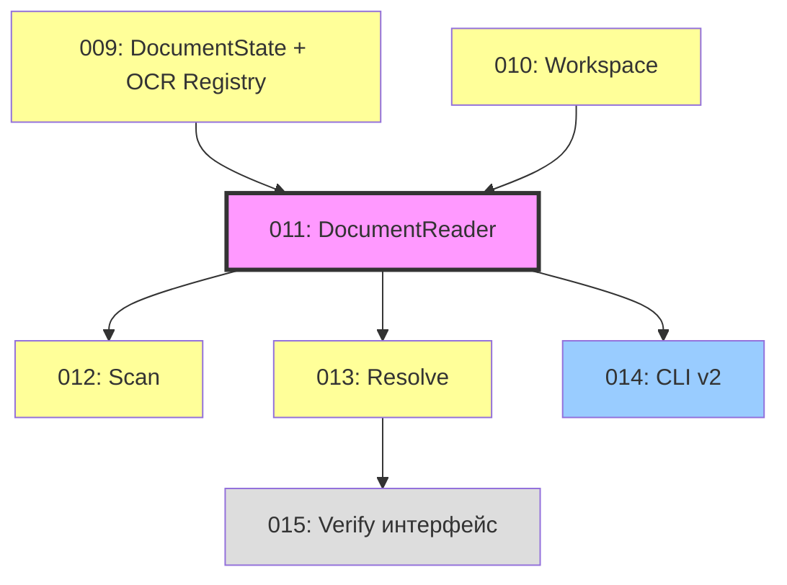

# Implementation Plan: vlm-ocr-doc-reader

**Версия:** 4.0
**Дата:** 2026-02-20
**Автор:** Tech Lead
**Статус:** Фаза 1 завершена, Фаза 2 — планирование задач (ADR 001 принят)

---

## Цель

Универсальный переиспользуемый Python-пакет для работы с документами через VLM и OCR.

---

## Фаза 1: v0.1.0 — Базовая реализация (ЗАВЕРШЕНА)

### Структура задач

| Задача | Модули | Статус |
|--------|--------|--------|
| 1. Base utilities | PDFRenderer, OCR нормализация, StateManager | Выполнена |
| 2. VLM processing | GeminiVLMClient, VLMAgent, DocumentProcessor | Выполнена |
| 3. OCR support | QwenOCRClient, OCRTool | Выполнена |
| 4. High-level operations | FullDescriptionOperation | Выполнена |
| 5. Критические баги | JSON mode, VLMAgent, OCR Tool | Выполнена |
| 6. pyproject.toml | Пакетирование, entry points | Выполнена |
| 7. CLI интерфейс | cli.py, argparse, logging | Выполнена |
| 8. Рефакторинг | Parallel OCR, conversation history, three-pass | Выполнена |

### Архитектура v0.1.0 (фактическая)

```
CLI → FullDescriptionOperation → DocumentProcessor → VLMAgent
                                                       ├── GeminiVLMClient (contents=messages)
                                                       └── ask_ocr → OCRTool(state_manager) → QwenOCRClient
```

Ключевые параметры: max_iterations=100, max_tool_workers=5, DPI=150.

### Результаты тестирования

| Запуск | Время | OCR calls | Parallel | Headers | Полный текст |
|--------|-------|-----------|----------|---------|-------------|
| run_174559 | 12 мин | 66 | Нет | 48 | Да |
| run_193215 | 6 мин | 65 | Да (5w) | 58 | Да |

---

## Фаза 2: v0.2.0 — Resolution Levels (ПЛАНИРОВАНИЕ)

**Основание:** ADR 001 (`decision_001_resolution_levels.md`)

### Суть изменений

Текущий монолитный подход (VLM делает всё за один invoke) заменяется поэтапной обработкой:

1. **Scan** (Level 0) — VLM читает текст, строит OCR Registry. OCR не вызывается.
2. **Resolve** (Level 1) — OCR выполняется по Registry. VLM не участвует.
3. **Verify** (Level 2) — N параллельных OCR-вызовов, majority voting. Только интерфейс в v0.2.0.

**DocumentReader** — новый публичный API. CLI, программный API, интеграция с проектом 07 — всё через него.

**Workspace** — директория `{stem}_{content_hash6}/` для персистенции состояния.

### Структура задач Фазы 2

| ID | Задача | Зависимости | Приоритет |
|----|--------|-------------|-----------|
| 009 | DocumentState + OCR Registry | — | High |
| 010 | Workspace (DiskStorage рефакторинг) | 009 | High |
| 011 | DocumentReader (публичный API) | 009, 010 | High |
| 012 | Scan — refactor Prompt, VLM возвращает Registry | 009, 011 | High |
| 013 | Resolve — OCR без VLM, page-based batching | 009, 011 | High |
| 014 | CLI v2 (scan/resolve/verify/full-description) | 011 | Medium |
| 015 | Verify — интерфейс (реализация стратегии отложена) | 013 | Low |

### Зависимости



### Параллельность

- **009 и 010** можно запускать параллельно (минимум зависимостей)
- **012 и 013** можно запускать параллельно после 011
- **015** откладывается (только интерфейс)

### Критический путь

009 → 011 → 012 + 013 → 014

### Что переиспользуется из v0.1.0

- **VLMAgent, VLMClient** — без изменений (используется при Scan)
- **OCRClient** — без изменений (используется при Resolve напрямую)
- **PDFRenderer** — без изменений ([G{N}] markers)
- **StateManager** — расширяется (OCR Registry, page states)
- **OCRTool** — сохраняется для обратной совместимости Scan (VLM может вызывать ask_ocr)

### Что меняется

- **full_description.py** — PROMPT_TEXT разделяется: Scan-промпт возвращает текст + Registry как структурированные данные (не через tool calling)
- **DocumentProcessor** — подчиняется DocumentReader, используется только при Scan
- **CLI** — субкоманды вместо единого entry point
- **Новые компоненты:** DocumentReader, DocumentState, OCRRegistry, Workspace

---

## История изменений

| Дата | Версия | Изменения | Автор |
|------|--------|-----------|-------|
| 2026-02-20 | 4.0 | Фаза 2 переосмыслена по ADR 001: Resolution Levels, задачи 009-015 | Tech Lead |
| 2026-02-20 | 3.0 | Фиксация фактической архитектуры v0.1.0, результаты тестирования | Tech Lead |
| 2026-01-27 | 2.0 | 4 задачи, invoke(), без Page Batching | Tech Lead |
| 2026-01-27 | 1.0 | Первый черновик | Tech Lead |
