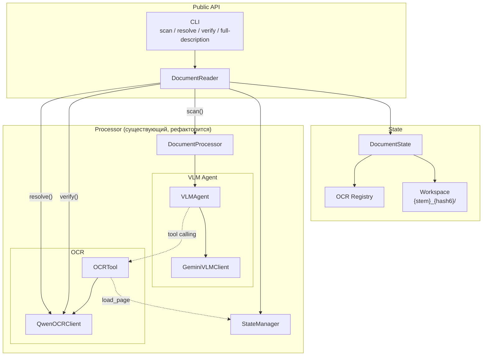

# Архитектура проекта vlm-ocr-doc-reader

**Версия:** 3.0
**Дата:** 2026-02-20
**Статус:** v0.1.0 реализована, v0.2.0 (Resolution Levels) — в планировании

---

## 1. Концептуальная модель

### Текущая (v0.1.0) и целевая (v0.2.0) архитектура

v0.1.0 работает через `FullDescriptionOperation → DocumentProcessor → VLMAgent`. Все три прохода (чтение, реестр, OCR) выполняются в одном VLM invoke.

v0.2.0 вводит **DocumentReader** как единственную точку входа и **Resolution Levels** для поэтапной обработки. См. ADR 001 (`decision_001_resolution_levels.md`).

### Целевая структура (v0.2.0)



**Ключевое изменение:** Resolve и Verify обходят VLM Agent — DocumentReader итерирует OCR Registry и вызывает OCR Client напрямую.

### Разделение ответственности

- **DocumentReader** — публичный API, lifecycle документа
- **DocumentState** — модель данных (что мы знаем: page states, OCR Registry)
- **DocumentProcessor** — оркестрация VLM (используется только при Scan)
- **Operations** — стратегии анализа (FullDescription, Triage, Extraction)

### Resolution Levels (ADR 001)

| Level | Название | Что делает | VLM | OCR |
|-------|----------|-----------|-----|-----|
| 0 | Scan | Чтение текста, структуры. Побочный продукт: OCR Registry | Да | Нет |
| 1 | Resolve | Исполнение OCR Registry для указанных страниц | Нет | Да |
| 2 | Verify | N параллельных OCR-вызовов, majority voting | Нет | Да (N раз) |

Гранулярность: level привязан к **странице**. При Resolve резолвятся все сущности на странице.

---

## 2. Текущая структура модулей (v0.1.0)

```
vlm_ocr_doc_reader/
├── __init__.py                    # Public API
├── cli.py                         # CLI entry point
├── core/
│   ├── processor.py               # DocumentProcessor
│   ├── vlm_agent.py               # VLMAgent (tool calling, ThreadPoolExecutor)
│   ├── vlm_client.py              # GeminiVLMClient (contents support)
│   ├── ocr_tool.py                # OCRTool (state_manager, ask_ocr)
│   ├── ocr_client.py              # QwenOCRClient
│   └── state.py                   # StateManager, MemoryStorage, DiskStorage
├── operations/
│   ├── base.py                    # BaseOperation
│   └── full_description.py        # FullDescriptionOperation (three-pass)
├── preprocessing/
│   └── renderer.py                # PDFRenderer ([G{N}] markers)
├── schemas/
│   ├── document.py                # DocumentData, HeaderInfo, TableInfo
│   ├── common.py                  # PageInfo
│   └── config.py                  # ProcessorConfig, VLMConfig, OCRConfig
└── utils/
    └── normalization.py           # OCR normalization
```

### Планируемые изменения для v0.2.0

Новые компоненты:
- `DocumentReader` — публичный API (scan/resolve/verify)
- `DocumentState` с `OCRRegistry` — персистентная модель знаний
- Workspace — директория с `{stem}_{content_hash6}/` поддиректориями

Рефакторинг:
- `DocumentProcessor` → подчинён DocumentReader, используется только при Scan
- `StateManager` → расширяется для хранения OCR Registry и page states
- `full_description.py` PROMPT_TEXT → разделяется на промпты по resolution levels
- CLI → команды `scan`, `resolve`, `verify`, `full-description` (обратная совместимость)

---

## 3. Ключевые архитектурные решения

### Действующие (v0.1.0)

**Agent → Client relation:** VLM Agent использует VLM Client, OCR Tool использует OCR Client.

**Conversation history:** VLM Agent хранит `self.messages`, передает `contents=self.messages` — полная история диалога Gemini.

**Uniform tool calling:** VLM Agent не знает про OCR — все tools вызываются через `handler(**func_args)`.

**Parallel tool execution:** ThreadPoolExecutor(max_workers=5), порядок сохраняется через `pool.map()`.

**Page Markers [G{N}]:** PDFRenderer штампует маркеры в верхнем левом углу.

**Init Order:** StateManager → VLMClient → OCRClient+OCRTool → VLMAgent → Pages.

### Принятые для v0.2.0 (ADR 001)

**Resolution Levels:** Scan (VLM only) → Resolve (OCR only) → Verify (OCR N раз). См. ADR 001.

**OCR Registry:** Персистентный артефакт — список сущностей с page_num, prompt, value, resolution level. Создаётся при Scan, заполняется при Resolve.

**DocumentReader:** Единственная точка входа. CLI, API, интеграции — всё через него.

**Workspace:** Директория с поддиректориями `{stem}_{content_hash6}/`. Идентификация по содержимому, не по имени файла.

**Resolve без VLM:** DocumentReader сам итерирует Registry и вызывает OCR Client напрямую. Батчинг становится тривиальным.

---

## 4. Интеграционные точки

### Контракт с 07_agentic-doc-processing

```python
@dataclass
class DocumentData:
    text: str                          # Полный текст (с OCR-верифицированными данными)
    structure: Dict[str, Any]          # {"headers": [...]}
    tables: List[Dict[str, Any]]       # Пустой в v0.1.0
```

Доступ через `reader.get_document_data()` (v0.2.0) или `FullDescriptionOperation.execute()` (v0.1.0).

### CLI (текущий v0.1.0)

```bash
vlm-ocr-reader <pdf_path> [--output-dir DIR] [--dpi DPI] [--max-tool-workers N] [--max-iterations N]
```

### CLI (целевой v0.2.0)

```bash
vlm-ocr-reader scan <pdf_path> --workspace ./workspace
vlm-ocr-reader resolve <pdf_path> --workspace ./workspace [--pages 48,49]
vlm-ocr-reader verify <pdf_path> --workspace ./workspace [--pages 48]
vlm-ocr-reader full-description <pdf_path>   # scan + resolve all (обратная совместимость)
```

---

## 5. Ограничения v0.1.0

- Только Gemini VLM / Qwen OCR
- Только FullDescriptionOperation
- OCR вызывается по одной сущности через VLM tool calling
- Общее время 8-страничного документа: ~6 мин

---

## История изменений

| Дата | Версия | Изменения | Автор |
|------|--------|-----------|-------|
| 2026-02-20 | 3.0 | Целевая архитектура v0.2.0: Resolution Levels, DocumentReader, Workspace, OCR Registry, Resolve без VLM (ADR 001) | Tech Lead |
| 2026-02-20 | 2.0 | Фактическая архитектура v0.1.0: conversation history, parallel OCR, three-pass, [G{N}] | Tech Lead |
| 2026-01-27 | 1.0 | Черновик архитектуры | Architect |
