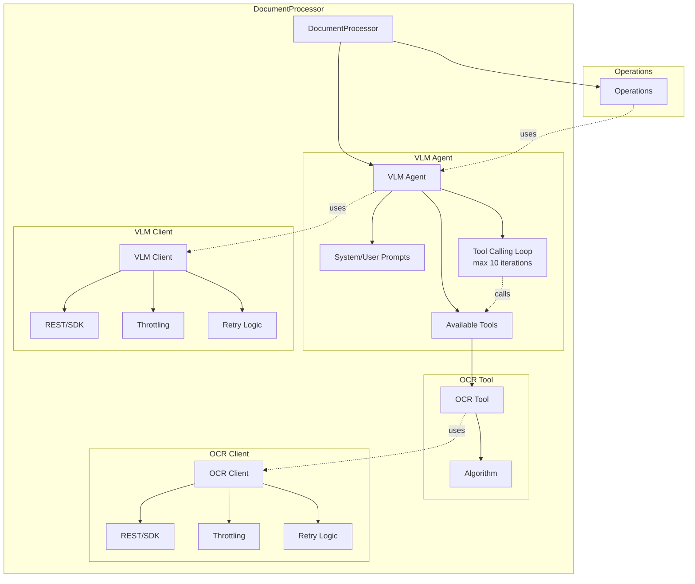

# Архитектура проекта vlm-ocr-doc-reader

**Версия:** 1.0
**Дата:** 2025-01-27
**Статус:** Черновик архитектуры

---

## 1. Концептуальная модель

### Разделение Agent vs Client

Модуль базируется на концептуальном разделении агентского и технического уровней:

- **VLM Agent** - агентская сущность (промпты, tool calling loop, инструменты)
- **VLM Client** - техническая реализация (REST/SDK, throttling, retry)
- **OCR Tool** - агентская сущность (алгоритм вызова, конфигурация)
- **OCR Client** - техническая реализация OCR API



### Ключевые принципы

1. **Agent → Client relation**: VLM Agent использует VLM Client, OCR Tool использует OCR Client
2. **Tool Calling Loop**: VLM → tool call → выполнить tool → вернули в VLM → повтор до max 10 итераций
3. **Все клиенты имеют retry-логику**
4. **OCR Tool** - отдельная сущность, используется VLM Agent через tools
5. **Прямой вызов OCR** - не поддерживается (только через VLM Agent)

---

## 2. Структура модулей

> **📢 Оговорка для Tech Lead:**
>
> Привет! Это предложение структуры от Architect. Ты волен корректировать состав файлов и организацию модулей исходя из результатов твоего анализа.
>
> **ВАЖНО:** Ориентируйся на проект `05_a_reports_ETL_02` - там уже есть рабочая реализация VLM/OCR клиентов, рендеринга PDF, батчинга. Переиспользуй паттерны.
>
> **⚠️ Если у тебя нет доступа к `05_a_reports_ETL_02` или `07_agentic-doc-processing`** - остановись и запроси доступ у пользователя.
>
> -- Architect

```
vlm_ocr_doc_reader/
├── __init__.py                    # Public API: UniversalDocumentProcessor
│
├── core/
│   ├── __init__.py
│   ├── processor.py               # DocumentProcessor (главный класс)
│   ├── vlm_agent.py               # VLMAgent (промпты, tool calling loop)
│   ├── vlm_client.py              # BaseVLMClient, GeminiVLMClient
│   ├── ocr_tool.py                # OCRTool (алгоритм вызова)
│   ├── ocr_client.py              # BaseOCRClient, QwenOCRClient
│   └── state.py                   # DocumentState, StorageBackends (memory/disk)
│
├── operations/
│   ├── __init__.py
│   ├── base.py                    # BaseOperation (абстрактный класс)
│   ├── full_description.py        # FullDescriptionOperation (контракт для 07)
│   ├── clustering.py              # ClusteringOperation
│   ├── triage.py                  # TriageOperation
│   └── extraction.py              # ExtractionOperation
│
├── preprocessing/
│   ├── __init__.py
│   ├── renderer.py                # PDFRenderer (pdf → png)
│   └── page_numberer.py           # PageNumberer (нумерация страниц, future)
│
├── schemas/
│   ├── __init__.py
│   ├── document.py                # DocumentData (контракт), TableInfo, HeaderInfo
│   ├── common.py                  # PageInfo, ClusterInfo, TriageResult
│   └── config.py                  # ProcessorConfig, VLMConfig, OCRConfig
│
└── utils/
    ├── __init__.py
    ├── batching.py                # PageBatching (из 05_a_reports_ETL_02)
    ├── normalization.py           # OCRNormalization (O→0, l→1)
    └── logging.py                 # Logger setup
```

---

## 3. Ключевые архитектурные решения

### 3.1. Operations Organization

**Принятый подход:** Operations импортируются как самостоятельные классы, при создании получают экземпляр процессора

```python
from vlm_ocr_doc_reader.operations import TriageOperation, ClusteringOperation

# Операции импортируются как классы
triage = TriageOperation(processor)
cluster = ClusteringOperation(processor)

# Вызов напрямую
result = triage.execute(prompt="...")
```

**Обоснование:**
- Гибкость, операции независимы
- Явная связь с процессором
- Возможность использовать операции отдельно

### 3.2. State Management

**Единая точка управления:** `core/state.py`

**Стратегии хранения:**
- **Memory** - если `state_dir` не указан (по умолчанию)
- **Disk** - если указан `state_dir` (JSON/YAML)
- **Database** - future (через клиент БД)

**Архитектурный запас:** Базовый интерфейс `StorageBackend` с реализациями для memory/disk. В будущем можно добавить `DatabaseStorage`.

**Что сохраняется:**
- Рендеренные страницы (PNG)
- VLM ответы
- Результаты operations

### 3.3. Batching Strategy

**Подход:** По количеству страниц (из конфигурации клиента)

**Обоснование:**
- Проще и надежнее чем токен-лимиты
- Переиспользование паттерна из `05_a_reports_ETL_02`
- Токен-лимиты ошибкоопасны (модель пытается уложиться → ошибки)

**Batch size настраивается** в конфигурации VLM/OCR клиентов.

### 3.4. Приоритеты Operations для v0.1.0

- **P0:** `FullDescriptionOperation` - контракт для `07_agentic-doc-processing`
- **P1:** `ClusteringOperation` - кластеризация страниц
- **P2:** `TriageOperation`, `ExtractionOperation` - расширенная функциональность

---

## 4. Интеграционные точки

### 4.1. Контракт с 07_agentic-doc-processing

**Основной метод:** `FullDescriptionOperation.execute()` возвращает `DocumentData`

**Структура DocumentData:**
```python
@dataclass
class DocumentData:
    text: str                                    # Полный текст документа
    structure: Dict[str, Any]                    # Иерархия заголовков
    tables: List[Dict[str, Any]] = field(default_factory=list)  # Таблицы
```

**Классификация таблиц:**
- `NUMERIC` - числовые таблицы
- `TEXT_MATRIX` - текстовые матрицы (с cell flattening)

**Cell Flattening:** Преобразование ячеек в список утверждений вида "заголовок строки + заголовок столбца → содержимое"

**⚠️ Важно:** Классификацию таблиц (NUMERIC/TEXT_MATRIX) в v0.1.0 не реализуем. Все таблицы возвращаем как есть без типа. Реализуем в будущих версиях.

### 4.2. Паттерны из 05_a_reports_ETL_02

**Переиспользовать:**
- `GeminiRestClient` - базовый VLM клиент с retry, exponential backoff
- `VLMClient` - обертка с throttling (min_interval_s: 0.6)
- `QwenClient` - OCR для числовых полей (формат ЗНАЧЕНИЕ/КОНТЕКСТ/ПОЯСНЕНИЕ)
- `pdf_utils.py` - рендеринг PDF→PNG (DPI: 110-150, quality: 80-85)
- PageBatching - группировка страниц (head/tail/union)
- HybridDialogueManager - function calling с инструментами

**НЕ переносить:**
- Специфичные поля аудиторских заключений
- Field processors (доменная логика аудита)

---

## 5. Ограничения v0.1.0

### Технологические ограничения

- **Только Gemini VLM** (`gemini-2.5-flash`)
- **Только Qwen OCR** (`qwen-vl-plus`)
- **Без аутентификации** - API ключи через переменные окружения
- **Хранение state** - только в памяти или в файлах (JSON/YAML)

### Функциональные ограничения

- **Простой triage** - только по промпту (без сложного алгоритма)
- **Без PageNumberer** - нумерация страниц не реализована (future)
- **Без классификации таблиц** - NUMERIC/TEXT_MATRIX не реализуем (future)
- **State management** - реализовать возможность сохранения состояния (будет использоваться при разработке и тестировании пайплайнов)

### Архитектурные ограничения

- **Без расширения клиентов** - нельзя добавить Claude VLM или Tesseract OCR
- **Без custom operations** - нельзя зарегистрировать свою операцию
- **Без batch prompts оптимизации** - последовательные вызовы

---

**История изменений:**

| Дата | Версия | Изменения | Автор |
|------|--------|-----------|-------|
| 2025-01-27 | 1.0 | Черновик архитектуры | Architect |
