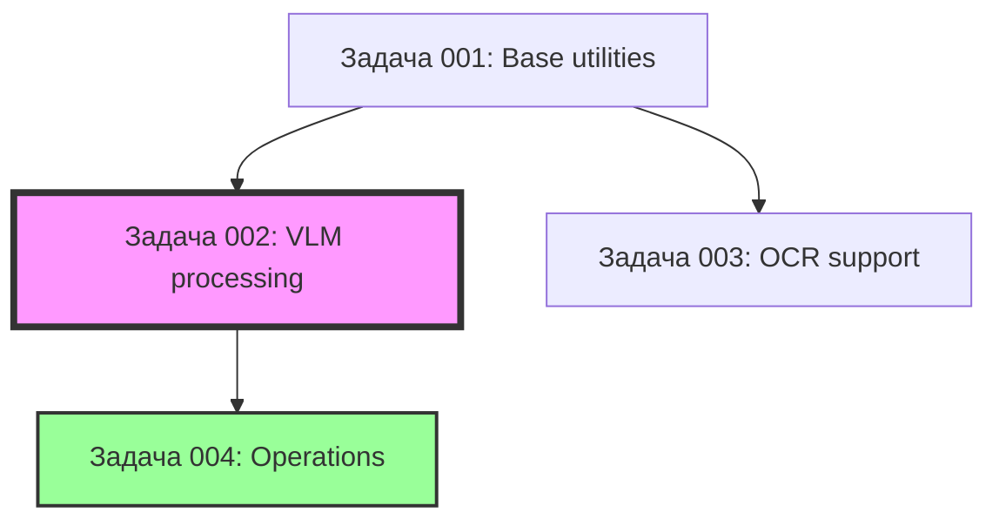

# Backlog: vlm-ocr-doc-reader

**Версия:** 2.0
**Дата:** 2025-01-27
**Владелец:** Tech Lead

---

## Задачи

| ID | Название | Приоритет | Статус | Дата начала | Дата завершения | Зависимости |
|----|----------|-----------|--------|-------------|-----------------|-------------|
| 001 | Base utilities (PDF Renderer, OCR нормализация, State Manager) | High | Выполнена | 2025-01-27 | 2025-01-27 | Нет |
| 002 | VLM processing (VLM Client, VLM Agent, DocumentProcessor) | High | Выполнена | 2025-01-27 | 2025-01-27 | Задача 001 |
| 003 | OCR support (OCR Client, OCR Tool) | Medium | Выполнена | 2025-01-27 | 2025-01-27 | Задача 001 |
| 004 | High-level operations (FullDescriptionOperation) | High | Выполнена | 2025-01-27 | 2025-01-27 | Задача 002 |
| 005 | Критические баги (JSON mode, VLMAgent, OCR Tool) | Critical | Выполнена | 2025-01-27 | 2025-01-28 | Задачи 001-004 |

---

## Детали задач

### Задача 001: Base utilities

**Модули:**
- PDF Renderer (рендеринг PDF→PNG)
- OCR нормализация (утилита для исправления OCR ошибок)
- State Manager (Memory + Disk backends)

**Критерии готовности:**
- [ ] `PDFRenderer.render_pdf()` для всех страниц
- [ ] `PDFRenderer.render_page()` с кастомным DPI
- [ ] `normalize_ocr_digits()` с заменами O→0, l→1, S→5, B→8
- [ ] `StateManager` с Memory и Disk backends
- [ ] Unit тесты для рендеринга (размер изображений, DPI)
- [ ] Unit тесты для State Manager (save/load)

**Reference:** `00_docs/architecture/implementation_plan.md` → Задача 1

**Reference код:** `02_src/_reference/pdf_utils.py`, `02_src/_reference/tools.py`

---

### Задача 002: VLM processing (критический путь)

**Модули:**
- VLM Client (Gemini REST API с retry и throttling)
- VLM Agent (tool calling loop)
- DocumentProcessor (главный класс)

**Критерии готовности:**
- [ ] `GeminiVLMClient.invoke()` с retry и throttling
- [ ] `VLMAgent.invoke()` с tool calling loop (max 10 итераций)
- [ ] `VLMAgent.register_tool()` для регистрации handlers
- [ ] `DocumentProcessor` с инициализацией из PDF/PNG
- [ ] `DocumentProcessor.pages` и `num_pages`
- [ ] Unit тесты для VLM Client (retry на 429/500)
- [ ] Unit тесты для throttling (min_interval_s)
- [ ] Unit тесты для tool calling loop (1, 2, 10 итераций)
- [ ] Unit тесты для DocumentProcessor (PDF vs PNG)

**Reference:** `00_docs/architecture/implementation_plan.md` → Задача 2

**Reference код:** `02_src/_reference/gemini_client.py`, `02_src/_reference/vlm_client.py`, `02_src/_reference/hybrid_dialogue.py`

---

### Задача 003: OCR support

**Модули:**
- OCR Client (Qwen VL API)
- OCR Tool (агентская обертка)

**Критерии готовности:**
- [ ] `QwenOCRClient.extract()` с retry logic
- [ ] `OCRTool.to_tool_definition()` - tool definition для VLM
- [ ] `OCRTool.execute()` с нормализацией
- [ ] Unit тесты для OCR Client

**Reference:** `00_docs/architecture/implementation_plan.md` → Задача 3

**Reference код:** `02_src/_reference/qwen_client.py`

---

### Задача 004: High-level operations

**Модули:**
- BaseOperation (абстрактный базовый класс)
- FullDescriptionOperation (основная операция)
- Схемы данных (DocumentData, HeaderInfo, TableInfo)

**Критерии готовности:**
- [ ] `BaseOperation` абстрактный класс
- [ ] `FullDescriptionOperation.execute()` с VLM промптами
- [ ] `DocumentData`, `HeaderInfo`, `TableInfo` схемы
- [ ] Unit тесты для FullDescriptionOperation
- [ ] Интеграционный тест: PDF → DocumentData
- [ ] Проверка контракта с проектом 07 (совпадение схем)

**Reference:** `00_docs/architecture/implementation_plan.md` → Задача 4

---

## Параллельность задач

**Можно запускать параллельно:**
- Задачи 001 и 002 (минимум зависимостей)
- Задача 003 с Задачей 002 (после завершения Задачи 001)

**Последовательная зависимость:**
- Задача 004 после завершения Задачи 002

**Диаграмма зависимостей:**

---

## Reference файлы

**Скопировано из `05_a_reports_ETL_02`:**
- `02_src/_reference/gemini_client.py` - Gemini REST API клиент
- `02_src/_reference/vlm_client.py` - VLM Client с throttling
- `02_src/_reference/qwen_client.py` - Qwen OCR клиент
- `02_src/_reference/pdf_utils.py` - PDF рендеринг
- `02_src/_reference/hybrid_dialogue.py` - Function calling pattern
- `02_src/_reference/tools.py` - OCR нормализация

---

## История изменений

| Дата | Версия | Изменения | Автор |
|------|--------|-----------|-------|
| 2025-01-27 | 2.0 | Переписан с укрупненными задачами (4 задачи вместо 37) | Tech Lead |
| 2025-01-27 | 1.0 | Первая версия (детализированный backlog) | Architect |
