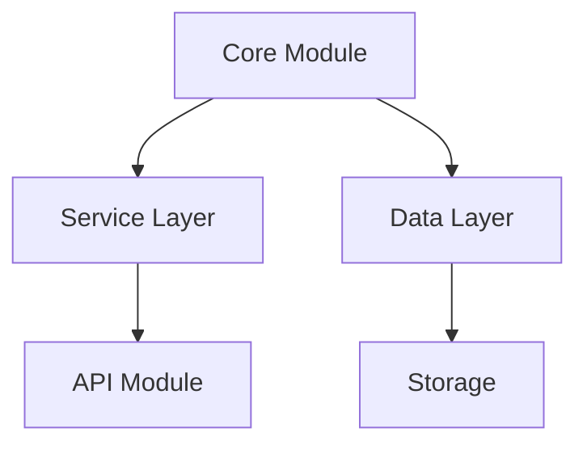
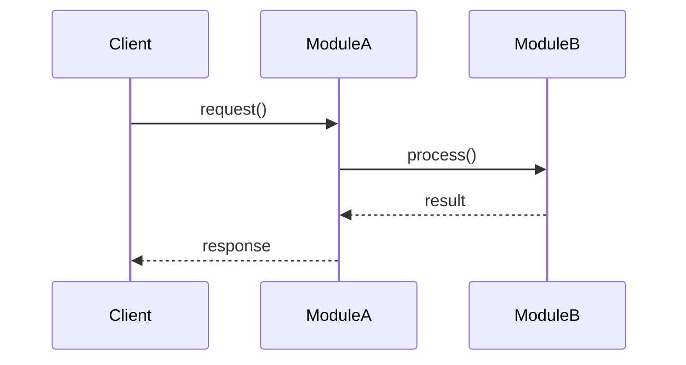
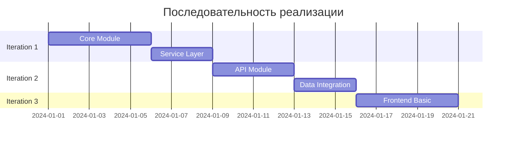

# Implementation Plan Template

Шаблон для создания плана реализации архитектуры.

## Структура документа

```markdown
# Implementation Plan: [Название проекта]

## Цель

[1-2 абзаца: что строим, зачем, ключевые требования]

## Обзор модулей

### Архитектурная схема



### Описание модулей

**Core Module**
- Назначение: [что делает]
- Зависимости: [от чего зависит]
- Предоставляет: [какие интерфейсы]

**Service Layer**
- Назначение: [что делает]
- Зависимости: Core Module
- Предоставляет: [какие интерфейсы]

[...для каждого модуля]

## Итерация 1: [Название фазы]

**Цель:** [Конкретный результат этой итерации]

**Модули для реализации:**
1. Module A
2. Module B

**Интерфейсы:**

### Module A

```typescript
// Основной интерфейс модуля
interface ModuleA {
  init(config: Config): Promise<void>;
  processData(input: DataType): Result;
  shutdown(): Promise<void>;
}

// Конфигурация
interface Config {
  option1: string;
  option2: number;
}
```

**Стратегия моков для Итерации 1:**
- **Database:** in-memory хранилище (Map/Dictionary)
- **External API:** статичные mock responses
- **Message Queue:** синхронная обработка без очереди
- **File Storage:** временная директория

**Критерии готовности:**
- [ ] Module A реализован с интерфейсом
- [ ] Module B реализован с интерфейсом
- [ ] Integration тесты Module A ↔ Module B
- [ ] Можно наблюдать работу через логи/VS

**Визуализация итерации:**



## Итерация 2: [Название фазы]

[Аналогичная структура]

## Итерация N: [Название фазы]

[Аналогичная структура]

## Критический путь



**Критическая цепочка:**
1. Core Module → Service Layer (необходима для всего)
2. API Module → Frontend (блокирует UI)
3. Data Integration → Production Ready (последний шаг)

**Параллельные работы:**
- Итерация 2: API Module и Storage Module можно делать параллельно
- Итерация 3: Frontend и Admin Panel можно делать параллельно

## Интерфейсы между модулями

### Core ↔ Service

```typescript
// Контракт взаимодействия
interface CoreService {
  execute(command: Command): Promise<Result>;
  query(request: QueryRequest): Promise<QueryResult>;
}

// Типы данных
type Command = {
  type: string;
  payload: any;
};

type QueryRequest = {
  entity: string;
  filter: Filter;
};
```

**Гарантии:**
- Service не вызывает Core напрямую, только через интерфейс
- Core не знает о Service, только предоставляет интерфейс
- Все асинхронные операции возвращают Promise

### Service ↔ API

[Аналогично для каждой пары модулей]

## Стратегия наблюдаемости

**Логирование:**
- Структурированные логи (JSON)
- Уровни: DEBUG, INFO, WARN, ERROR
- Каждый модуль логирует входы/выходы

**Метрики:**
- Время выполнения операций
- Количество обработанных запросов
- Ошибки по типам

**Визуализация:**
- Console output с цветовым кодированием
- VS Code Debug Console
- Опционально: simple web dashboard для мониторинга

## Переход к production

**Итерация N+1: Production Readiness**
- Замена моков на реальные компоненты
- Database: реальная БД вместо in-memory
- Message Queue: реальная очередь
- External API: настоящие интеграции
- Мониторинг и alerting
```

## Принципы хорошего плана

**1. Итеративность**
- Каждая итерация самодостаточна
- Можно тестировать результат
- Можно показать работающую систему

**2. Минимизация зависимостей**
- Начинать с модулей без внешних зависимостей
- Моки для блокирующих зависимостей
- Параллельная работа где возможно

**3. Наблюдаемость**
- На каждом шаге видно что происходит
- Логи, метрики, визуализация
- Легко дебажить

**4. Интерфейсы первым делом**
- Четкие контракты
- Типизированные интерфейсы
- Документированные гарантии

## Что НЕ включать в план

❌ Детали реализации (это для Analyst/Developer)
❌ Конкретный код
❌ Архитектурные решения (это ADR от Architect)
❌ Задачи для разработчиков (это для Architect)

✅ Порядок реализации
✅ Интерфейсы и контракты
✅ Стратегия моков
✅ Критический путь
✅ Визуализация архитектуры

## Размер диаграмм

**Правило:** Одна диаграмма должна помещаться на А4

**Если диаграмма слишком большая:**
- Разбей на несколько уровней (high-level → detailed)
- Создай отдельные диаграммы для каждой итерации
- Используй группировку модулей

**Пример разбивки:**
- Диаграмма 1: Общая архитектура (все модули)
- Диаграмма 2: Детали Core Module
- Диаграмма 3: Детали Service Layer
- Диаграмма 4: Последовательность работы (sequence diagram)
